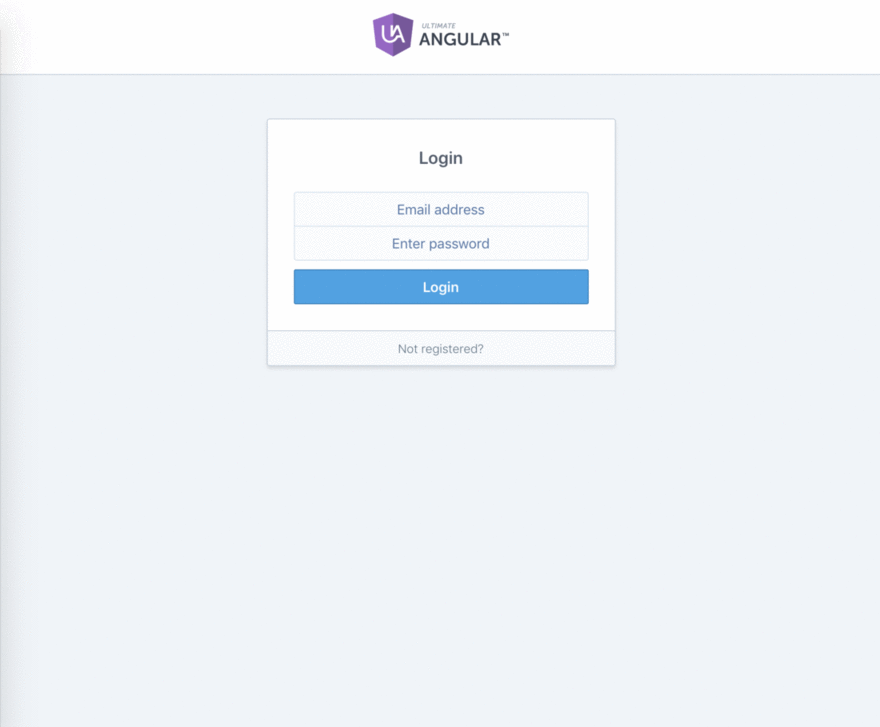

# Firebase-for-Web Workout Fitness App
> An Angular 7 and Firebase application that monitors your health, schedule and meals. Learned and Inspired from Todd Motto


College Bus Tracking System

Problem Statement:

Over several flight booking websites, different organisations offer differnt pricings. It takes time and efforts for users to check different websites to get best prices for flight bookings each time.

Proposed Solution :

This project proposes a “Website for brining unified results scrapping multiple flight booking websites and provide a list of prices for flights per user journey". Currently the app works for India and domestic travel only. The project's scope is to extend it for other countries and international travel to multiple countries.



Angular application File / Folder Architecture summary:

1. `package.json`: consists of Node/NPM library/package/module dependencies for application development
2. `node_modues` - folder consists of all installed packages
3. `src/main.ts` - entry point to angular application. src/index.html
4. `app/app.module.ts` - route module of application
5. `app/app.component.ts` - route component of application
6. `ng serve / npm start` -> main.ts (index.html) -> app.module.ts -> app.component.ts -> (app.component.html + css)


Functionality & Concepts used :

The Website has a very simple and interactive interface which helps the users select their route flight and find its prices. Following are few Web and Firebase concepts used to achieve the functionalities in website :
<br> 
<ul><li> Components : to add header, footer, search feature in the website. Header and footer components are reused in the website. </li>
<li> Directives : Define how the view components are placed. It also describes the overall structure of the website components. </li>
<li> Databinding : Show the synchronisation between model and view. It populates the websites after mapping the model and view of each website page.
</li>
<li> Firebase Auth : To authenticate users to the website.</li>
<li> Firebase Realtime database : To add most recent prices of the flights for different routes. </li>
<li> Firebase Hosting - To host the website. </li>
</ul>

Application Link & Future Scope :

The app is currently in the Alpha testing phase for only some users.

Once the website is fully tested and functional, we plan to take the app to beta testing stage where it will be available in all of the country to be tested by the users (one state at a time). We aim that by next year 100,000 users in India will use this fitness app for controlling their fitness and help them control their health. 

#### How to run

```
$ npm install       - Installs frontend dependencies
$ npm start         - Runs your frontend application at http://localhost:4200
```
